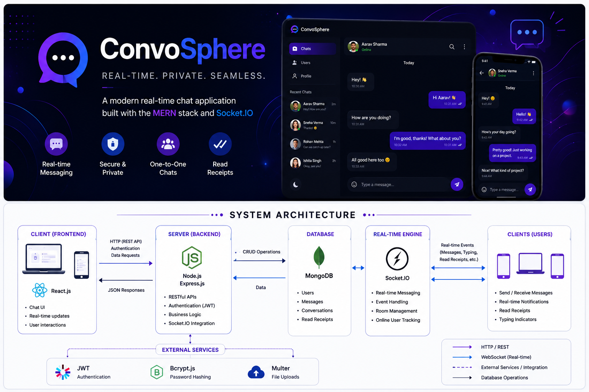
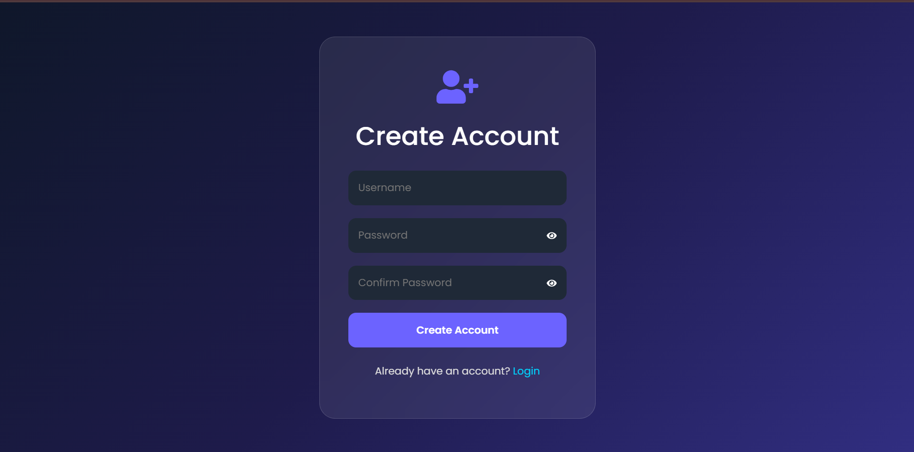
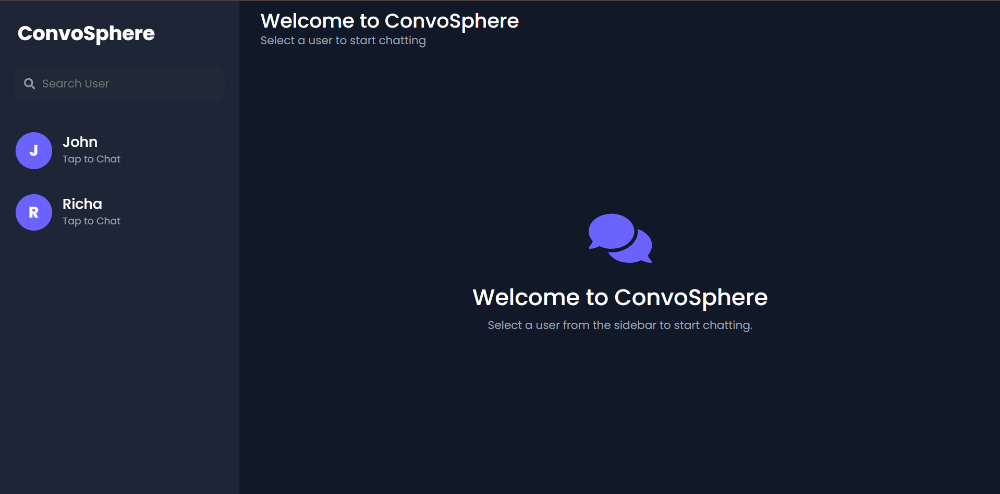

# 💬 ConvoSphere: MERN Stack Real-Time Chat Application


---

# 📌 Problem Statement

In today's digital world, instant communication has become an essential part of personal and professional interactions. Many messaging platforms either lack real-time responsiveness, provide limited user interaction features, or rely on complex infrastructures that are difficult for beginners to understand.

**ConvoSphere** addresses these challenges by providing a modern real-time chat application built with the **MERN Stack** and **Socket.IO**. It enables users to communicate instantly through secure one-to-one messaging while maintaining a smooth, responsive, and user-friendly experience.

---

# Features

-  Secure User Authentication (JWT & bcrypt)
-  User Registration & Login
-  Real-Time One-to-One Messaging
-  Socket.IO Powered Instant Communication
-  Live Typing Indicator
-  Emoji Support
-  Persistent Chat History
-  Message Timestamps
-  Responsive User Interface
-  Modern Animated UI using Framer Motion
-  Protected Routes
-  MongoDB Database Integration

---

# 🏗️ System Architecture


---

# 🛠️ Tech Stack

## **Frontend**

- React.js
- React Router DOM
- Axios
- Bootstrap
- Framer Motion
- React Icons
- Emoji Picker React

## **Backend**

- Node.js
- Express.js
- Socket.IO

## **Database**

- MongoDB
- Mongoose

## **Authentication**

- JWT (JSON Web Token)
- bcrypt

---

# 📸 Project Screenshots

## 🔐 Login Page


## 📝 Registration Page



## 💬 Chat Dashboard



---

# 🌐 Live Demo

---

# 📂 Project Structure

```text
ConvoSphere
│
├── ChatApplicationFrontend
│   └── frontend
│       ├── public
│       ├── src
│       ├── package.json
│       └── vite.config.js
│
├── chatApplication
│   ├── controllers
│   ├── middleware
│   ├── models
│   ├── routes
│   ├── socket
│   ├── package.json
│   └── .env.example
│
├── Banner.png
├── SystemArchitecture.png
└── README.md
```

---

# 🚀 Key Highlights

-  MERN Stack Architecture
-  Real-Time Communication using Socket.IO
-  Secure JWT Authentication
-  Password Encryption using bcrypt
-  RESTful API Development
-  MongoDB Database Integration
-  Live Typing Indicator
-  Responsive User Interface
-  Modern Animated Design with Framer Motion
-  Modular Project Structure

---

#  Future Enhancements

- Read Receipts (Double Blue Tick)
- Online / Offline Status
- Image & File Sharing
- Group Chat Support
- Push Notifications
- Dark & Light Theme
- Audio & Video Calling

---

# Connect With Me

💼 **LinkedIn:**  
https://www.linkedin.com/in/mishikamendiratta/

💻 **GitHub:**  
https://github.com/mishika2004

📧 **Email:**  
mishikamendiratta@gmail.com

---

# ⭐ Show Your Support
If you found this project useful or interesting, please consider giving it a **⭐ Star** on GitHub.
